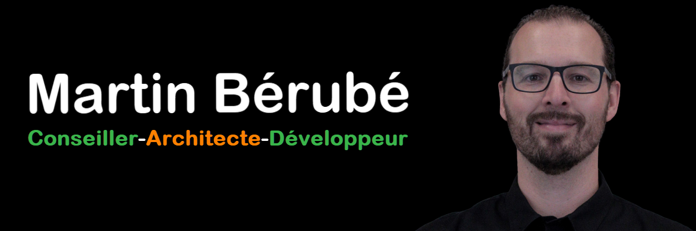

# À propos de moi

Mon nom est Martin Bérubé, alias **{MabeProductique}**. Je suis un **conseiller**, **architecte** et **développeur** qui crée des **solutions** pour améliorer la **productivité** des entreprises.

## 💻 Environnements

## 🛠️ IDEs & outils de développement

## 🤖 IA — Fournisseurs

## 🤖 IA — Interfaces

## 📝 Langages

et beaucoup d'autres...

## 📬 Me trouver

<!--  
## Stats
Attendre la résolution de Issue: #3594. Stats pas disponible pour repos dans organisation

-->

<!-- crédit badges = https://ileriayo.github.io/markdown-badges --> 

